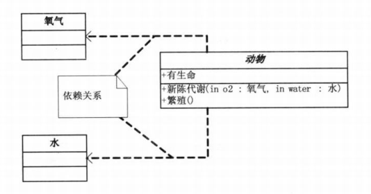

# UML 基础

## 类
+ 类名：
    + 普通类：正体
    + 抽象类：斜体
+ 类的特性：字段或属性；
+ 类的操作：方法或行为；
+ 符号：
    + "+"：public
    + "-"：private
    + "#"：protected
+ 示例：

| *动物* |
| ------ |
| + 有生命 |
| + 新陈代谢() + 繁殖() |

## 接口
+ 普通表示法：
    + &lt;&lt;interface&gt;&gt; + 接口名
    + 接口方法
+ 普通表示法示例：

| &lt;&lt;interface&gt;&gt;   接口名 | 
| ------ |
| + 方法() |

+ 棒棒糖表示法：
    + 圆圈旁：接口名称
    + 接口方法在实现类中实现
+ 棒棒糖表示法示例：

## 类与类之间的继承关系：空心三角形 + 实线（空心三角形指向父类）

## 类与接口之间的实现关系：空心三角形 + 虚线（空心三角形指向接口）

## 类与类之间的关联关系：实现箭头（箭头指向被使用的类）

## 类与类之间的聚合关系：空心菱形 + 实现箭头（空心菱形指向集合类，实现箭头指向被包含的类）

## 类与类之阿金的组合关系：实心菱形 + 实现箭头（实心菱形指向主体，实现箭头指向部分）
+ 聚合与组合的关系：
    + 聚合：两者的生命周期不一致；如集体 + 个体；
    + 组合：两者的生命周期一致；如主体 + 部分；

## 类与类之间的依赖关系：虚线箭头（虚线箭头指向被依赖的类）

## UML 类图图示样例

